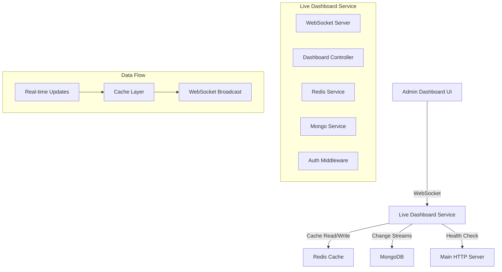

# 🎨 Live Dashboard System Design

## 🏛️ System Architecture

### **High-Level Architecture**



## 📊 Data Flow Design

### **1. Real-Time Data Pipeline**

```
MongoDB Change → Redis Cache → WebSocket → Admin Dashboard
    ↓              ↓             ↓            ↓
  Triggers      Updates       Broadcasts   Updates UI
```

### **2. Caching Strategy**

```typescript
interface CacheStrategy {
  // Critical metrics - 5 second TTL
  criticalMetrics: {
    patientCount: number;
    emergencyAlerts: Alert[];
    roomOccupancy: RoomStatus[];
  };

  // Standard metrics - 30 second TTL
  standardMetrics: {
    todayAppointments: number;
    revenue: RevenueData;
    staffActivity: StaffStatus[];
  };

  // Historical data - 5 minute TTL
  historicalData: {
    hourlyStats: HourlyStats[];
    departmentMetrics: DepartmentData[];
  };
}
```

## 🔄 Real-Time Update Mechanisms

### **1. MongoDB Change Streams**

```typescript
// Monitor critical collections
const watchCollections = [
  "patients", // New registrations
  "appointments", // Appointment changes
  "rooms", // Room status updates
  "bills", // Revenue updates
  "workflows", // Patient flow changes
];

// Change stream pipeline
const pipeline = [
  {
    $match: {
      operationType: { $in: ["insert", "update", "delete"] },
      "fullDocument.isActive": true,
    },
  },
];
```

### **2. Redis Pub/Sub Pattern**

```typescript
// Publisher (Change Stream Handler)
redis.publish("dashboard:update", {
  type: "patient_registered",
  data: patientData,
  timestamp: Date.now(),
});

// Subscriber (WebSocket Server)
redis.subscribe("dashboard:update", (message) => {
  io.emit("dashboard_update", JSON.parse(message));
});
```

## 🏗️ Component Design

### **1. WebSocket Server (server.ts)**

```typescript
class LiveDashboardServer {
  private io: Server;
  private redis: Redis;
  private dashboardService: DashboardService;

  constructor() {
    this.setupWebSocket();
    this.setupRedis();
    this.setupChangeStreams();
  }

  private setupWebSocket(): void {
    // WebSocket configuration
    // Authentication middleware
    // Event handlers
  }

  private setupChangeStreams(): void {
    // MongoDB change stream setup
    // Data processing pipeline
    // Cache updates
  }
}
```

### **2. Dashboard Service (dashboardService.ts)**

```typescript
class DashboardService {
  async getCriticalMetrics(): Promise<CriticalMetrics> {
    // Check Redis cache first
    // Fallback to MongoDB if cache miss
    // Update cache with fresh data
  }

  async processChangeStreamEvent(event: ChangeStreamEvent): Promise<void> {
    // Process database change
    // Update relevant cache keys
    // Broadcast to connected clients
  }

  async calculateRealTimeStats(): Promise<DashboardStats> {
    // Aggregate real-time statistics
    // Use Redis for fast calculations
    // Return formatted data
  }
}
```

### **3. Redis Service (redisService.ts)**

```typescript
class RedisService {
  async setMetric(key: string, value: any, ttl: number): Promise<void> {
    // Set with expiration
    // Handle serialization
    // Error handling
  }

  async getMetric(key: string): Promise<any> {
    // Get from cache
    // Handle deserialization
    // Return null if expired
  }

  async invalidatePattern(pattern: string): Promise<void> {
    // Bulk invalidation
    // Pattern matching
    // Cleanup expired keys
  }
}
```

## 📡 WebSocket Event Design

### **Client → Server Events**

```typescript
interface ClientEvents {
  // Authentication
  authenticate: (token: string) => void;

  // Subscription management
  subscribe_metrics: (metrics: string[]) => void;
  unsubscribe_metrics: (metrics: string[]) => void;

  // Data requests
  request_snapshot: () => void;
  request_historical: (timeRange: TimeRange) => void;
}
```

### **Server → Client Events**

```typescript
interface ServerEvents {
  // Authentication responses
  authenticated: (success: boolean) => void;
  auth_error: (error: string) => void;

  // Data updates
  dashboard_update: (data: DashboardUpdate) => void;
  metrics_snapshot: (snapshot: MetricsSnapshot) => void;
  historical_data: (data: HistoricalData) => void;

  // System events
  connection_status: (status: ConnectionStatus) => void;
  error: (error: ErrorMessage) => void;
}
```

## 🔒 Security Design

### **1. Authentication Flow**

```
1. Admin connects via WebSocket
2. Client sends JWT token
3. Server validates token against main DB
4. Server stores authenticated session
5. Client receives authentication confirmation
6. Real-time data streaming begins
```

### **2. Authorization Levels**

```typescript
enum AdminPermissionLevel {
  SUPER_ADMIN = "super_admin", // All metrics
  ADMIN = "admin", // Department-specific
  VIEWER = "viewer", // Read-only access
}
```

## 📊 Performance Optimization

### **1. Caching Layers**

```
L1 Cache: In-Memory (Node.js) - 1 second TTL
L2 Cache: Redis - Variable TTL (5s to 5m)
L3 Cache: MongoDB - Source of truth
```

### **2. Connection Management**

```typescript
interface ConnectionPool {
  maxConnections: 1000; // Max concurrent connections
  heartbeatInterval: 30000; // 30 second ping/pong
  reconnectAttempts: 5; // Auto-reconnect attempts
  rateLimiting: {
    requestsPerMinute: 60; // Rate limit per client
    burstLimit: 10; // Burst allowance
  };
}
```

### **3. Data Aggregation Strategy**

```typescript
// Batch updates for efficiency
const batchProcessor = {
  batchSize: 100, // Process 100 changes at once
  batchInterval: 1000, // Every 1 second
  priorityQueue: true, // Critical updates first
};
```

## 🔄 Scalability Design

### **1. Horizontal Scaling**

```
Load Balancer → Multiple Dashboard Service Instances
                ↓
            Shared Redis Cluster
                ↓
            MongoDB Replica Set
```

### **2. Service Discovery**

```typescript
interface ServiceRegistry {
  instances: DashboardInstance[];
  healthCheck: () => Promise<boolean>;
  loadBalancing: "round-robin" | "least-connections";
}
```

## 📈 Monitoring & Observability

### **1. Metrics Collection**

```typescript
interface ServiceMetrics {
  connections: {
    active: number;
    total: number;
    failed: number;
  };
  performance: {
    responseTime: number;
    throughput: number;
    errorRate: number;
  };
  resources: {
    memoryUsage: number;
    cpuUsage: number;
    redisConnections: number;
  };
}
```

### **2. Health Checks**

```typescript
const healthChecks = {
  redis: () => redis.ping(),
  mongodb: () => mongoose.connection.readyState === 1,
  websocket: () => io.engine.clientsCount >= 0,
  memory: () => process.memoryUsage().heapUsed < MAX_MEMORY,
};
```

## 🚨 Error Handling & Recovery

### **1. Graceful Degradation**

```
Redis Down → Fallback to MongoDB (slower updates)
MongoDB Down → Serve cached data with warnings
WebSocket Issues → Auto-reconnection with exponential backoff
```

### **2. Circuit Breaker Pattern**

```typescript
class CircuitBreaker {
  private failureCount = 0;
  private lastFailureTime = 0;
  private state: "CLOSED" | "OPEN" | "HALF_OPEN" = "CLOSED";

  async execute<T>(operation: () => Promise<T>): Promise<T> {
    // Circuit breaker logic
    // Fail fast when circuit is open
    // Gradual recovery when half-open
  }
}
```

This design ensures a robust, scalable, and performant real-time dashboard system that operates independently of the main HTTP server while providing administrators with live insights into hospital operations.
